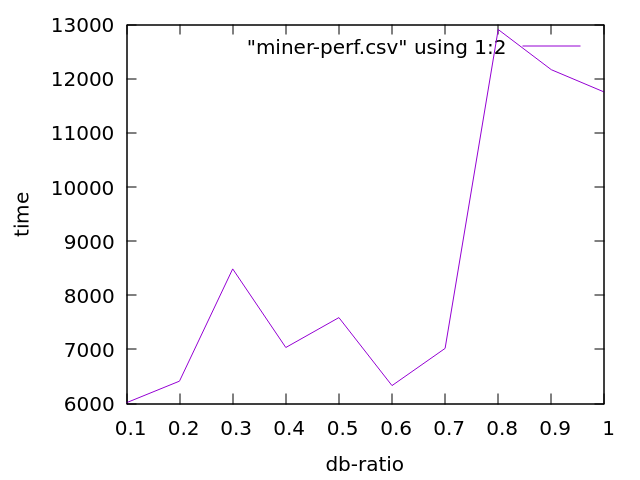
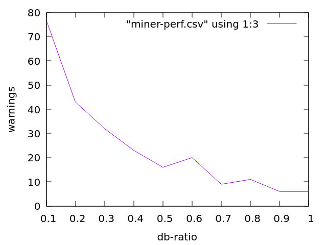
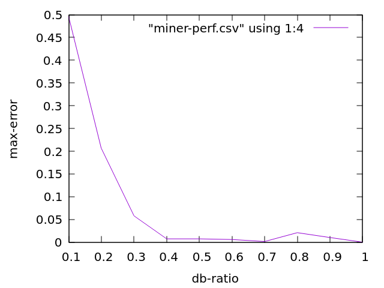

# Benchmark pattern miner w.r.t. db-ratio

## Overview

This document presents a few charts obtained by running
`mine-bio-as.scm` while varying `db-ratio` from 0.1 to 1.0.  The
parameter `db-ratio` allows to regulate the subsampling that is taking
place to speed up counting as well as reduce RAM while estimating the
surprisingness of a pattern.  The drawback is that it introduces
innacuracies in the surprisingness measure.  This document is meant to
give us some idea of how much.

## Benchmark results

Results were obtained by running `mine-bio-as.scm` with the following
project revisions:

```
+-------------------+---------+
|repository         |git hash |
+-------------------+---------+
|reasoning-bio-as-xp|edd5bff92|
|atomspace          |efdc038cd|
|ure                |380cccc9c|
|miner              |8d0cc06db|
+-------------------+---------+
```

The table below relates `db-ratio` to

1. Overall mining run-time in second.
2. Number of warnings occuring during mining.
3. Maximum deviation error between the surprisingness obtained with
   `db-ratio` set to 1 and the `db-ratio` of that row.

```
+--------+-------+--------+---------+
|db-ratio|time(s)|warnings|max-error|
+--------+-------+--------+---------+
|1.0     |11752  |6       |0        |
|0.9     |12166  |6       |0.010170 |
|0.8     |12907  |11      |0.020805 |
|0.7     |7019   |9       |0.0014405|
|0.6     |6332   |20      |0.0058627|
|0.5     |7588   |16      |0.0072237|
|0.4     |7036   |23      |0.0072237|
|0.3     |8488   |32      |0.057766 |
|0.2     |6419   |43      |0.20612  |
|0.1     |6021   |77      |0.49585  |
+--------+-------+--------+---------+
```

Let us detail each column.

### db-ratio vs time

The graph below, obtained from the table above, shows that run-time
increases with `db-ratio`, as expected.



Note that values of `db-ratio` from 0.1 to 0.5 was obtained on an
Intel i7-6700HQ 2.60GHz, while values from 0.6 to 1.0 was obtained on
an Intel Xeon E5-2667 v3 3.20GHz likely explaining the counter-trend
behavior between 0.5 and 0.6, the overall trend remains however.

### db-ratio vs warnings

The `warnings` column counts the number of times the empirical
probability was estimated to zero, which isn't supposed to happen
since the pattern support is above a positive threshold.  Ideally this
number should be zero.  It is already 6 for the default `db-ratio` of
1.0, meaning such default is already producing inaccuracies in the
surprisingness measure, which are however unreported in that benchmark
due to the computational limits associated with running the experiment
with higher values of `db-ratio`.  Ideally future benchmarks should
incorporate higher values of `db-ratio`.



Nevertheless the graph shows much degradation with 77 warnings for a
`db-ratio` of 0.1, which is probably too much given that there are
only 133 mined patterns (note however that warnings can potentional
happen for sub-pattern components, which are many more than 133, thus
77 warnings might not be as bad as it seems).

### db-ratio vs max-error

The `max-error` mesures the worst difference between surprisingness
measure of the patterns between `db-ratio` 1.0 and the `db-ratio` of
the corresponding row.  As shown below there is a substantial
degradation as `db-ratio` goes into the 0.2 territory and below.



However the `max-error` might be a bit misleading given that it
considers the worst case, that of a single pattern among 133.  For
technical reasons comparing the mean error was difficult (due to the
fact that not all experiments were run on the same machine and atoms
had different handle IDs) but it should be noted that at glance the
mean errors seemed fairly low, likely below 0.1 event in the worst
case when `db-ratio` is equal to 0.1.

## Conclusion

Overall the `db-ratio` parameter is doing what it was designed for and
there is a clear sweet-spot in term of reducing run-time while
minimizing errors within the range of 0.4 to 0.7. Another aspect that
was not benchmarked but is important is the reduction in RAM allowing
the miner to be run on a 16GB machine for values of `db-ratio` of 0.5
or below, while a value 1.0 requires 32GB of RAM.
